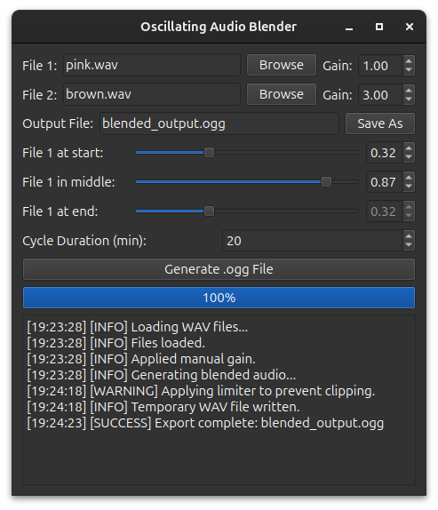

# Oscillating Audio Blender

This is a simple GUI tool to blend two WAV files using an oscillating pattern over time, and export the result as an OGG file.



## Features

- Load two WAV files and blend them over time
- Custom gain, blend shape (start → middle → end)
- Clean GUI with PyQt6
- Export to `.ogg` format
- Uses `config.ini` to remember default settings
- Also supports command-line usage

## Requirements

- Python 3.9 or newer
- `ffmpeg` installed and available in PATH (for OGG export)

## Setup

1. **Install Python**  
   Download and install from: https://www.python.org/downloads/

2. **Install dependencies**  
   Open a terminal (Command Prompt or PowerShell), navigate to this folder, and run:

   ```bash
   pip install -r requirements.txt
   ```

3. **Install ffmpeg (for audio export)**  
   Download from: https://ffmpeg.org/download.html  
   Add `ffmpeg/bin` to your system PATH.

4. **Run the app**

   ```bash
   python gui_audio_blender.py
   ```

## Configuration

The app loads default values from `config.ini` (optional). Example:

```ini
[FILES]
file_1 = pink.wav
file_2 = brown.wav

[TIMING]
cycle_minutes = 1

[MIX]
gain_1 = 1.0
gain_2 = 2.0
blend_1_start = 0.1
blend_1_middle = 0.9

[AUDIO]
sample_rate = 22050
```

## Command-Line Usage

You can also run the app from the terminal using CLI flags:

```bash
python main.py --file-1 pink.wav --file-2 brown.wav --gain-1 1.0 --gain-2 2.0 --blend-start 0.2 --blend-middle 0.8 --cycle-duration 2
```

### CLI Flags

| Flag              | Description                                 |
|-------------------|---------------------------------------------|
| `--file1`         | Path to first WAV file (File 1)             |
| `--file2`         | Path to second WAV file (File 2)            |
| `--gain1`         | Gain multiplier for File 1 (e.g., 1.0)      |
| `--gain2`         | Gain multiplier for File 2 (e.g., 2.0)      |
| `--blend-start`   | File 1’s blend value at start (0–1)         |
| `--blend-middle`  | File 1’s blend value in middle (0–1)        |
| `--cycle-duration`| Cycle duration in minutes (e.g., 2)         |
| `--sample-rate`   | Audio sample rate (e.g., 22050)             |
| `--output`        | Name of the output `.ogg` file              |

If no flags are given, values are read from `config.ini`.
